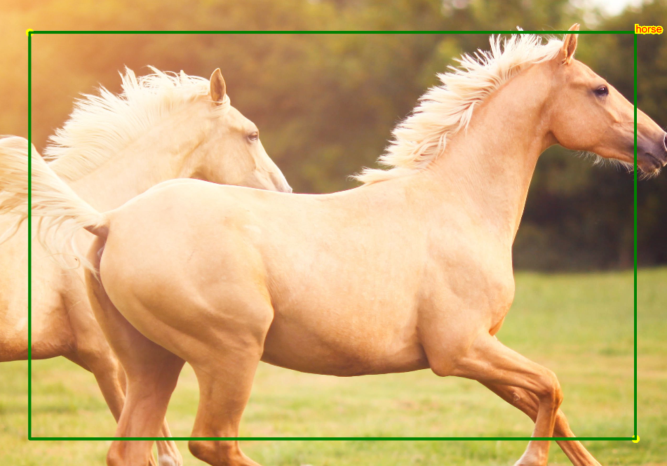

# Waldo
p5.js powered image annotation tool for object detection models.

* [Bounding Box Demo - press play and click around in the gray square](https://editor.p5js.org/hamza.ryzvy/sketches/sGSK2Bgly)

* [Bounding Box on some Image](https://editor.p5js.org/hamza.ryzvy/sketches/UhYIE21ye), you can now press `Ctrl+z` to undo a bounding box and `Ctrl+b` to view total number of bounding boxes on screen I'm the console.
## Version to Version Screenshot
### Current Version

